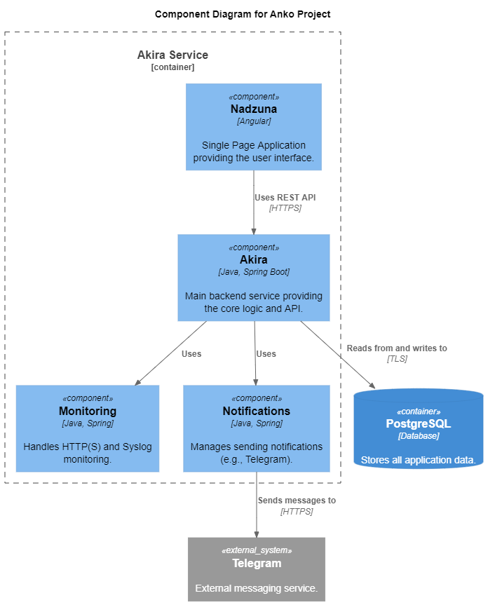

== Akira Project

Simple project for monitoring and notifications about fails.

== Functional

include::doc/features/http_monitoring.adoc[]

include::doc/features/syslog_monitoring.adoc[]

include::doc/features/notifications.adoc[]

include::doc/features/self_monitoring.adoc[]

== Dependencies

[source,toml]
----
include::gradle/libs.versions.toml[]
----

== Architecture

== Local Development

To run the project locally, you need Docker and Java 24 installed.

1.  **Start the database:**
    
    Navigate to the `docker` directory and run:
    [source,bash]
    ----
    docker-compose up -d
    ----

2.  **Run the application:**
    
    You can run the `AkiraApplication` main class from your IDE or use the Gradle wrapper:
    [source,bash]
    ----
    ./gradlew bootRun
    ----

3.  **Access the application:**
    
    The frontend will be available at http://localhost:8080.
    The default credentials are `admin` / `admin`.

